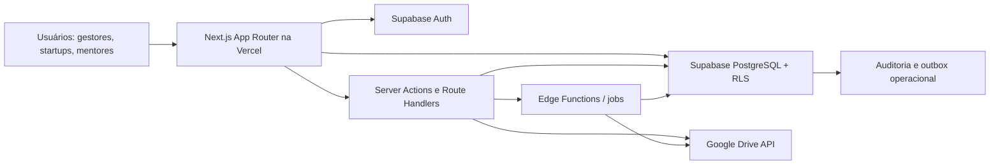
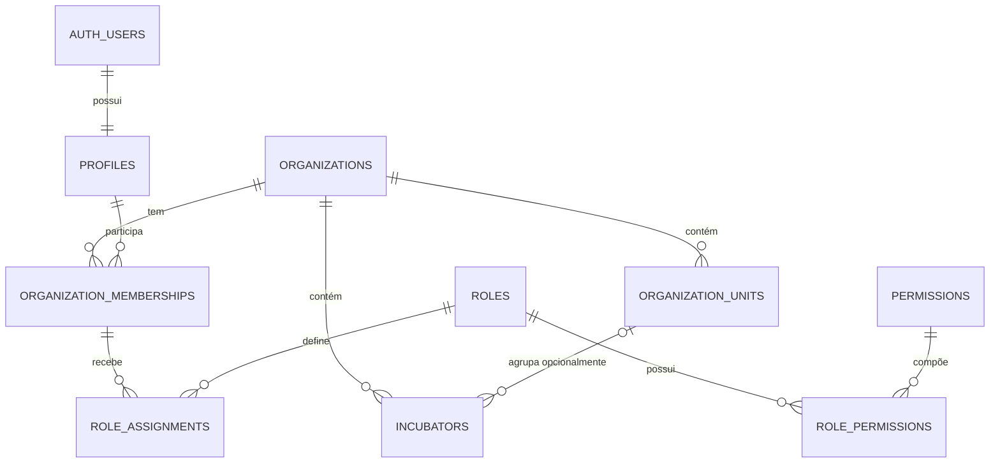

# Arquitetura proposta

## 1. Escopo deste documento

Esta arquitetura traduz o [SDD](./SDD.md) para uma fundação implementável. Ela não amplia o escopo funcional: nesta primeira etapa, somente autenticação, shell da aplicação, tenancy, RBAC/RLS, auditoria mínima e contratos da integração com Google Drive serão preparados. Módulos de negócio permanecem como contextos futuros.

## 2. Princípios arquiteturais

1. `organization_id` é a fronteira primária de isolamento, não um filtro de interface.
2. Toda autorização de dados expostos é aplicada no PostgreSQL por RLS.
3. O contexto de organização ativa melhora navegação, mas nunca substitui a autorização.
4. CERNE é um módulo opcional e desacoplado; ausência de vínculo metodológico nunca bloqueia objetos operacionais.
5. Supabase é a fonte de verdade para metadados, relações, permissões e auditoria.
6. Google Drive armazena bytes grandes; possuir uma URL do Drive não concede autorização no produto.
7. Operações sensíveis e integrações externas passam por código de servidor.
8. Regras de domínio têm um único local canônico e são testáveis sem UI.
9. Estados vazio, carregando, erro e sucesso fazem parte do contrato de cada jornada.
10. A fundação deve suportar evolução modular sem antecipar um LMS ou todos os módulos do SDD.

## 3. Contexto e componentes



### 3.1 Next.js/Vercel

- App Router e React Server Components por padrão.
- Client Components somente para interatividade, formulários e widgets que precisem de estado no navegador.
- Route Groups para separar páginas públicas, autenticação e área privada.
- Server Actions para mutações coesas da UI; Route Handlers versionados para integrações, uploads e contratos externos.
- Zod nas fronteiras de entrada e React Hook Form nos formulários interativos.
- Tailwind CSS e componentes acessíveis baseados em primitivas semânticas.
- `error.tsx`, `global-error.tsx`, `loading.tsx`, `not-found.tsx` e estados locais por rota.

### 3.2 Supabase

- Auth para e-mail/senha, Google OAuth, recuperação e sessão.
- PostgreSQL como fonte transacional.
- RLS em todas as tabelas de schemas expostos.
- Publishable key no navegador; secret key/service role somente em ambiente de servidor estritamente controlado.
- RPCs apenas quando uma transação, autorização ou agregação não for expressável com segurança por operações comuns.
- Funções `SECURITY DEFINER` excepcionais, pequenas, no schema privado, com `search_path` vazio, privilégios revogados por padrão e testes específicos.

### 3.3 Google Drive

- Drive Compartilhado institucional por ambiente.
- Conta de serviço/integração adicionada ao Drive Compartilhado com o menor papel suficiente.
- Upload resumível direto para uma URL de sessão curta, criada por backend após autorização.
- Acesso mediado por ID interno do arquivo.
- Reconciliação periódica de arquivos pendentes, ausentes ou alterados externamente.

## 4. Estrutura de diretórios proposta

```text
app/
  (public)/
  (auth)/
    login/
    forgot-password/
    reset-password/
    callback/
  (private)/
    o/[organizationSlug]/
      layout.tsx
      dashboard/
      startups/
      programas/
      diagnosticos/
      planos-de-acao/
      mentorias/
      conteudos/
      indicadores/
      gestao-incubadora/
      configuracoes/
  api/v1/
  error.tsx
  global-error.tsx
  loading.tsx
  not-found.tsx
components/
  ui/
  layout/
  auth/
  dashboard/
features/
  identity/
  tenancy/
  authorization/
  files/
lib/
  env/
  supabase/
  auth/
  validation/
  errors/
  observability/
services/
  drive/
  email/
supabase/
  migrations/
  seed.sql
  tests/
tests/
  unit/
  integration/
docs/
```

Os nomes de domínio internos serão em inglês para alinhar banco, TypeScript e APIs. Textos de interface e documentação de produto permanecem em português. Rotas visíveis podem usar português.

## 5. Autenticação e sessão

### 5.1 Fluxos

- Login por e-mail/senha.
- Google OAuth com callback controlado e allowlist de `redirectTo`.
- Recuperação de senha com token tratado no servidor.
- Logout com invalidação da sessão disponível e limpeza de cookies.
- Verificação de identidade no servidor com claims validadas; não confiar no objeto de usuário de `getSession()` para autorização.
- Renovação de cookies pelo mecanismo recomendado do `@supabase/ssr` para a versão do Next.js instalada.

### 5.2 Perfil seguro

`profiles.id` referencia `auth.users.id`. A criação será idempotente e mínima. A opção preferida é um trigger de `auth.users` que chama função pequena no schema privado, com `SECURITY DEFINER` justificado, `search_path = ''`, `EXECUTE` revogado de `PUBLIC`, `anon` e `authenticated`, e nenhum uso de `raw_user_meta_data` para autorização. Nome e avatar podem ser copiados apenas como dados de apresentação e podem ser alterados depois.

### 5.3 Proteção de rotas

- A camada de sessão barra acesso anônimo e encaminha para login.
- O layout `/o/[organizationSlug]` resolve a organização solicitada.
- A consulta de dados continua protegida por RLS; middleware/proxy não é fronteira suficiente.
- Superadmin não ganha acesso por flag editável no frontend ou em `user_metadata`.

## 6. Fundação multi-tenant

### 6.1 Contexto ativo

A organização ativa será explícita na URL: `/o/[organizationSlug]/...`. Uma preferência de última organização pode ser salva, mas serve apenas para redirecionamento. Cada consulta deriva o `organization_id` da organização resolvida e a RLS confirma a associação do usuário.

### 6.2 Modelo de escopo



### 6.3 Tabelas iniciais propostas

| Tabela                     | Finalidade                                      | Fronteira tenant                      |
| -------------------------- | ----------------------------------------------- | ------------------------------------- |
| `profiles`                 | Dados públicos internos mínimos do usuário      | Usuário próprio e escopos autorizados |
| `organizations`            | Tenant raiz                                     | `id`                                  |
| `organization_units`       | Unidade administrativa opcional                 | `organization_id`                     |
| `incubators`               | Unidade gestora de incubação                    | `organization_id`                     |
| `organization_memberships` | Associação usuário-organização e status         | `organization_id`                     |
| `roles`                    | Papéis de sistema e customizáveis               | `organization_id`                     |
| `permissions`              | Catálogo estável de capacidades                 | global                                |
| `role_permissions`         | Composição de papel                             | herdada do papel                      |
| `role_assignments`         | Papel aplicado a organização/unidade/incubadora | `organization_id` + FK de escopo      |
| `invitations`              | Convites com expiração e consumo único          | `organization_id`                     |
| `user_preferences`         | Preferência de organização, idioma e UI         | usuário próprio                       |
| `audit_logs`               | Eventos de segurança e negócio                  | `organization_id`, imutável           |
| `integration_accounts`     | Metadados de integrações; nunca segredos brutos | `organization_id`                     |
| `files`                    | Registro lógico e estado do objeto no Drive     | `organization_id`                     |
| `file_versions`            | Versões físicas e checksums                     | herdada de `files`                    |
| `file_links`               | Associação do arquivo com recurso de negócio    | `organization_id`                     |
| `file_access_logs`         | Auditoria de acesso e download                  | `organization_id`                     |

### 6.4 Convenções de dados

- UUIDs gerados pelo banco.
- `created_at` e `updated_at` como `timestamptz not null`; trigger de `updated_at` somente em tabelas mutáveis.
- `created_by`/`updated_by` onde auditoria de autoria for necessária.
- `organization_id not null` em toda tabela de negócio, mesmo quando derivável por join, para RLS simples e índices seletivos.
- FKs compostas ou validações para impedir que relações cruzem organizações.
- Índices iniciados por `organization_id` para consultas tenant-scoped.
- `deleted_at` apenas em agregados que precisam de restauração/retenção; tabelas de ligação e catálogos efêmeros usam exclusão física controlada.
- Enums PostgreSQL apenas para estados estáveis; catálogos configuráveis ficam em tabelas.
- JSONB limitado a configurações extensíveis com schema Zod e versionamento; relações centrais não ficam escondidas em JSON.

## 7. RBAC e RLS

### 7.1 Camadas de decisão

1. **Associação:** o usuário é membro ativo da organização?
2. **Capacidade:** algum papel no escopo concede a permissão requerida?
3. **Atribuição contextual:** o recurso exige vínculo específico com incubadora, programa ou startup?
4. **Classificação:** o dado é público, interno, confidencial ou restrito?
5. **Estado:** registros arquivados, excluídos ou imutáveis aceitam a operação?

### 7.2 Padrão das políticas

- `SELECT`: associação ativa + escopo + classificação.
- `INSERT`: `WITH CHECK` exige organização autorizada e escopo válido.
- `UPDATE`: `USING` e `WITH CHECK`, impedindo troca de `organization_id` e de proprietário lógico.
- `DELETE`: somente papéis autorizados; exclusão lógica não será implementada como permissão ampla de update.
- Tabelas sem necessidade de acesso direto pelo cliente ficam em schema não exposto ou com privilégios revogados.
- Policies usam `TO authenticated` junto de predicados de autorização; `TO authenticated` isolado é insuficiente.

### 7.3 Funções auxiliares implementadas

- `private.is_active_org_member(org_id uuid)`
- `private.has_permission(org_id uuid, permission_code text, unit_id uuid, incubator_id uuid)`
- `private.is_platform_admin()`

As funções são pequenas, usam nomes qualificados e `search_path=''`. Os dois predicados chamados pelas policies possuem `EXECUTE` apenas para `authenticated`; `is_platform_admin` não é diretamente executável pelo cliente. Os RPCs públicos `create_organization` e `accept_invitation` aplicam autorização própria e transações indivisíveis.

### 7.4 Matriz mínima de testes de isolamento

- Membro de A lê/escreve recurso de A permitido.
- Membro de A não lê, insere, atualiza nem exclui recurso de B.
- Usuário com memberships A e B acessa cada tenant somente pelo escopo correspondente.
- Usuário suspenso perde acesso imediatamente.
- Papel de organização não implica acesso de plataforma.
- Papel em incubadora não concede acesso a outra incubadora da mesma organização quando o dado é escopo-restrito.
- Usuário não altera `organization_id` de registro existente.
- `anon` não acessa tabelas de negócio.
- Secret/service role não é utilizada por testes do cliente nem empacotada no frontend.

## 8. Módulos e fronteiras futuras

Os contextos `programs`, `startups`, `assessments`, `action-plans`, `contents`, `tasks`, `mentoring`, `indicators` e `methodologies` serão adicionados por migrations e features independentes. O shell pode exibir itens de navegação desabilitados ou páginas de placeholder, mas não simular persistência real. Dados fictícios do dashboard devem ser marcados como demonstração.

CERNE será um pacote de dados/metodologia opcional sobre o contexto genérico `methodologies`. Relações metodológicas ficam em tabela associativa; nenhuma FK `cerne_* not null` poderá existir em programas, atividades, conteúdos, mentorias ou planos.

## 9. Erros, observabilidade e auditoria

- Erro de domínio padronizado: `code`, `message`, `details`, `request_id`.
- Mensagens ao usuário não expõem stack, SQL, tokens ou identificadores secretos.
- Logs técnicos incluem `request_id`; `user_id` e `organization_id` somente quando apropriado e sem dados pessoais desnecessários.
- `audit_logs` é append-only e registra mudanças de permissão, notas, prazos, metadados sensíveis e acessos a arquivos restritos.
- Auditoria de negócio não substitui logs de infraestrutura, e vice-versa.

## 10. Estratégia de testes da fundação

- **Unitários:** validação de env, resolução de permissões, schemas Zod e estados de UI.
- **Integração:** Auth callbacks, criação de perfil, memberships, RPCs e RLS.
- **Segurança:** matriz cross-tenant para todas as operações CRUD.
- **Componentes:** acessibilidade básica, navegação por teclado e estados vazio/loading/error.
- **E2E mínimo:** login, seleção de organização, acesso ao dashboard, tentativa de acesso cruzado e logout.
- **Banco:** migrations do zero, seed idempotente, lint SQL/advisors e reversibilidade por migration corretiva.

## 11. Deploy e ambientes

- Desenvolvimento local com variáveis falsas/seguras e projeto Supabase de desenvolvimento.
- Preview Vercel nunca aponta para produção; usa staging ou branches Supabase quando a estratégia for aprovada.
- Produção tem projeto Supabase e Drive Compartilhado próprios.
- CI bloqueia merge quando lint, formatter, typecheck, testes ou validação de migrations falham.
- Migrations são aplicadas como etapa controlada; rollback de aplicação não depende de migration destrutiva.

## 12. Dependências arquiteturais externas

- Supabase Auth/PostgreSQL/RLS e estratégia de chaves publishable/secret.
- Google Cloud project, Drive API, Shared Drive e conta de integração.
- Vercel project, ambientes e domínio de callback OAuth.
- Provedor de e-mail transacional ainda não escolhido.
- Política institucional de LGPD, retenção, portabilidade e classificação.

## 13. Pontos que exigem decisão

Os bloqueios e suposições estão registrados em [ASSUMPTIONS_AND_GAPS.md](./ASSUMPTIONS_AND_GAPS.md). A hierarquia multi-tenant e a governança de superadmin foram resolvidas no Marco 3. A principal decisão operacional restante é a disponibilidade de um Drive Compartilhado institucional por ambiente.
