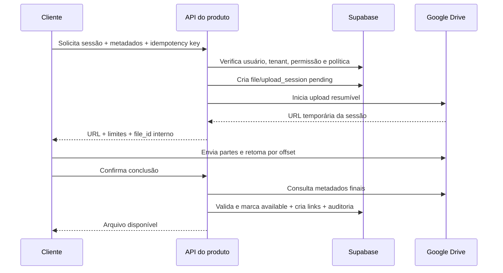

# Integração com Google Drive

## 1. Objetivo e não objetivos

Este documento define o fluxo e os contratos da integração antes do upload completo. Google Drive armazena arquivos grandes; Supabase mantém autorização, metadados, referências, versões, estado e auditoria.

Não faz parte da fundação:

- implementar um gerenciador de arquivos completo;
- usar permissões nativas do Drive como autorização primária do produto;
- criar links públicos permanentes;
- armazenar credenciais Google no navegador;
- concluir upload real antes de validar Workspace, Shared Drive, cotas e CORS.

## 2. Arquitetura do serviço

```typescript
interface LargeFileStorageService {
  createUploadSession(input: CreateUploadSessionInput): Promise<UploadSession>;
  completeUpload(input: CompleteUploadInput): Promise<StoredFileMetadata>;
  getAuthorizedAccess(input: AuthorizedAccessInput): Promise<AuthorizedAccess>;
  moveToTrash(input: FileOperationInput): Promise<void>;
  restore(input: FileOperationInput): Promise<void>;
  reconcile(input: ReconcileInput): Promise<ReconcileResult>;
}
```

`GoogleDriveLargeFileStorageService` implementará essa interface. Domínio e UI não importam o SDK Google diretamente. Uma implementação fake/in-memory permitirá testes sem credenciais reais.

## 3. Autenticação proposta

### 3.1 Produção e homologação

- Um Google Cloud project por organização operacional ou uma estratégia central aprovada.
- Drive API habilitada.
- Uma conta de serviço por ambiente, adicionada diretamente como membro do Shared Drive.
- Menor papel que permita criar, ler metadados, mover para lixeira/restaurar e organizar pastas necessárias.
- Credenciais em Vercel/Supabase secrets; nunca em `NEXT_PUBLIC_*`, banco em texto puro ou Git.
- Rotação documentada e conta de emergência administrada pela instituição.

Domain-wide delegation não será habilitada por padrão. Ela só será considerada se existir requisito de agir em nome de usuários ou acessar recursos fora do Shared Drive dedicado.

### 3.2 Desenvolvimento

- Shared Drive/pasta de testes sem dados reais.
- Credencial de desenvolvimento separada.
- Serviço fake como padrão em testes unitários.
- Nenhum teste automatizado exige conta pessoal de desenvolvedor.

## 4. Estrutura de pastas

```text
/PLATAFORMA
  /ORG_<organization_id>
    /INSTITUCIONAL
    /PROGRAMAS/<program_id>/<cohort_id>
    /STARTUPS/<startup_id>
      /DOCUMENTOS
      /ENTREGAS
      /DIAGNOSTICOS
      /MENTORIAS
    /CONTEUDOS
    /EVIDENCIAS_CERNE
    /RELATORIOS
    /LIXEIRA_LOGICA
```

Regras:

- IDs internos, não nomes de exibição, formam segmentos estáveis.
- Nomes originais ficam em metadados; mudanças de nome de startup não movem toda a árvore.
- O usuário navega por relações do sistema, não por caminho físico.
- `organization_id` é validado antes de qualquer operação.
- Pastas são criadas idempotentemente e seus IDs ficam em metadados de integração.
- `EVIDENCIAS_CERNE` é opcional e não é criada enquanto o módulo estiver desabilitado.

## 5. Modelo de metadados no Supabase

### 5.1 `files`

- `id`, `organization_id`
- `provider` (`google_drive`)
- `provider_file_id`
- `provider_drive_id`
- `provider_parent_id`
- `original_name`, `display_name`
- `mime_type`, `size_bytes`, `checksum`
- `classification` (`public`, `internal`, `confidential`, `restricted`)
- `status` (`pending`, `uploading`, `validating`, `available`, `quarantined`, `failed`, `trashed`, `missing`, `purged`)
- `logical_owner_type`, `logical_owner_id` apenas se o padrão polimórfico for aprovado; preferir `file_links` tipados.
- `created_by`, `created_at`, `updated_at`, `deleted_at`
- `upload_expires_at`, `last_reconciled_at`, `failure_code`

### 5.2 `file_versions`

- `file_id`, `version_number`
- `provider_file_id` ou revision ID quando suportado pela estratégia
- `mime_type`, `size_bytes`, `checksum`
- `created_by`, `created_at`
- `superseded_at`

### 5.3 `file_links`

Relaciona um arquivo a zero ou vários recursos com semântica explícita: documento, entrega, evidência, conteúdo, relatório. O vínculo contém `organization_id`, finalidade, visibilidade e data. A implementação final deve preferir FKs tipadas a um `resource_id` genérico sem integridade.

### 5.4 `file_access_logs`

- usuário, organização, arquivo e tipo de operação;
- resultado permitido/negado;
- `request_id`, IP truncado/hasheado conforme política, user agent quando necessário;
- timestamp e motivo de acesso para classes restritas quando exigido.

### 5.5 `upload_sessions`

- arquivo lógico, chave de idempotência e usuário;
- URL da sessão nunca registrada integralmente em logs;
- tamanho esperado, offset conhecido, expiração e tentativas;
- status e erro sanitizado.

## 6. Fluxo de upload resumível



### 6.1 Criação da sessão

1. Validar sessão do usuário e organização da URL.
2. Validar permissão para o recurso relacionado.
3. Validar nome, MIME declarado, tamanho, classificação e cota.
4. Resolver/criar pasta física de forma idempotente.
5. Criar `files` e `upload_sessions` como `pending` numa transação.
6. Solicitar sessão resumível ao Drive.
7. Persistir somente identificadores/expiração necessários; nunca logar a URL completa.
8. Retornar URL temporária e parâmetros de partes ao cliente.

### 6.2 Envio

- O navegador envia bytes diretamente ao Drive.
- Progresso e offset ficam no cliente; estado recuperável fica na sessão.
- Retries usam backoff exponencial com jitter.
- A sessão pode ser retomada após refresh se ainda válida e pertencente ao mesmo usuário/tenant.
- O arquivo permanece indisponível para outros usuários até validação final.

### 6.3 Conclusão

- `/complete` é idempotente.
- Backend consulta Drive e compara ID, Shared Drive, pasta, MIME e tamanho.
- Checksum é armazenado quando fornecido/confiável; ausência não implica sucesso falso.
- Em sucesso: `available`, versão, `file_link` e auditoria numa transação.
- Em divergência: `quarantined` ou `failed`, sem link de acesso.

## 7. Acesso, preview e download

1. Cliente solicita `/api/v1/files/{id}/access` usando ID interno.
2. Backend carrega metadados sob RLS e aplica classificação/escopo.
3. Acesso permitido é auditado antes da entrega.
4. Para classes interna/confidencial, usar URL temporária controlada ou proxy conforme capacidade do Drive.
5. Para classe restrita, preferir streaming/proxy e políticas mais curtas, após spike de limites da Vercel.
6. Nunca aceitar URL ou `provider_file_id` arbitrário vindo do cliente como autorização.

## 8. Permissões e compartilhamento

- Shared Drive não é compartilhado diretamente com cada usuário do produto.
- A conta de integração controla o armazenamento físico.
- Autorização fina ocorre no Supabase por membership, role assignment, vínculo do recurso e classificação.
- Compartilhamento externo é uma operação administrativa explícita, auditada e fora do fluxo padrão.
- Links “anyone with the link” são proibidos para arquivos internos, confidenciais ou restritos.

## 9. Exclusão, restauração e retenção

### 9.1 Exclusão lógica

- Marcar `deleted_at/status=trashed` no banco após autorização.
- Mover arquivo para lixeira do Drive ou pasta de lixeira lógica conforme capacidade e política.
- Remover acesso normal, preservar auditoria e permitir restauração durante a janela definida.

### 9.2 Restauração

- Verificar prazo de retenção e permissão.
- Confirmar existência no Drive.
- Restaurar local físico e estado no banco de forma idempotente.
- Registrar ator, motivo e resultado.

### 9.3 Purge

- Job separado e privilegiado.
- Exige política vencida e, para classes sensíveis, aprovação configurável.
- Tenta excluir fisicamente no Drive, depois marca `purged` preservando registro mínimo de auditoria.
- Falha parcial permanece retentável; nunca declarar purge se o Drive não confirmou.

## 10. Falhas parciais e reconciliação

| Falha                                       | Estado                      | Recuperação                                             |
| ------------------------------------------- | --------------------------- | ------------------------------------------------------- |
| Registro criado, sessão Drive falha         | `failed`/`pending` expirado | retry idempotente ou limpeza                            |
| Upload termina, `/complete` não chega       | `uploading`                 | job consulta sessão/Drive                               |
| Drive confirma, transação DB falha          | órfão externo               | reconciliador localiza por appProperties/correlation ID |
| DB disponível, arquivo removido fora do app | `missing`                   | alerta, restauração ou encerramento auditado            |
| Metadata diverge                            | `quarantined`               | revisão/revalidação                                     |
| Link de negócio falha                       | arquivo disponível sem link | retry transacional/idempotente                          |
| Exclusão no DB, Drive falha                 | `trash_pending`             | job de retry                                            |

O reconciliador diário compara registros não terminais e uma janela de alterações do Drive. Todas as operações externas usam chave de correlação e idempotência.

## 11. Segurança

- Credenciais apenas no servidor e com rotação.
- Validação de MIME por metadados e, quando possível, conteúdo; extensão não é confiável.
- Tamanho máximo e cota por organização.
- Nomes normalizados para exibição; caminhos nunca derivados sem sanitização.
- Proteção contra SSRF: backend não busca URLs arbitrárias como parte do upload.
- Antivírus/quarentena planejados antes de aceitar tipos de alto risco.
- Logs não contêm URL de sessão, tokens, conteúdo ou credenciais.
- Ações de arquivo restrito exigem auditoria reforçada.

## 12. Testes necessários antes do upload completo

- Serviço fake cobre sucesso, retry, expiração e falhas parciais.
- Teste de contrato com Drive de desenvolvimento.
- Upload interrompido e retomado.
- Sessão expirada.
- Confirmação duplicada.
- Tentativa cross-tenant.
- Arquivo removido externamente.
- Exclusão/restauração/purge.
- MIME/tamanho divergentes.
- Usuário com URL de sessão sem membership válida.
- Verificação de que credenciais e URLs não aparecem no bundle/logs.

## 13. Spike obrigatório

Antes da implementação real:

1. confirmar Shared Drive e conta de serviço;
2. validar criação de sessão resumível e CORS em browser;
3. medir limites/tamanho de partes e retomada;
4. validar acesso temporário/preview sem link público;
5. confirmar modelo de checksum/revision do Drive;
6. testar limites de streaming na Vercel;
7. decidir se Cloud Run é necessário para classes/tamanhos específicos;
8. registrar resultados em decisão arquitetural.

## 14. Estado implementado no Marco 4

A fundação foi implementada sem ativar o provedor:

- `LargeFileStorageService` e fake in-memory, usado somente por testes;
- schemas Zod para sessão, conclusão, acesso, escopo e operações;
- máquina de estados equivalente no TypeScript e em trigger PostgreSQL;
- `files`, `file_versions`, `file_links`, `file_access_logs` e `upload_sessions` com RLS;
- permissões `file.read`, `file.manage` e `file.audit` por escopo;
- rotas autenticadas e fail-closed atrás de `GOOGLE_DRIVE_UPLOAD_ENABLED=false`;
- painel em Configurações com contagem real, sem dados demonstrativos.

Decisões confirmadas na revisão das APIs vigentes:

- uploads retomáveis devem interpretar `308 Resume Incomplete` e o header `Range`, sem presumir o último offset recebido;
- operações em Shared Drive usarão `supportsAllDrives=true`; buscas serão limitadas a `corpora=drive`, `driveId` e `includeItemsFromAllDrives=true`;
- o identificador interno `file_id` será salvo em `appProperties` para reconciliação, sem transferir autorização ao Drive;
- lixeira é reversível por janela limitada pelo Drive, mas a retenção institucional continua sendo B-04.

Referências: [uploads retomáveis](https://developers.google.com/workspace/drive/api/guides/manage-uploads), [suporte a Shared Drives](https://developers.google.com/workspace/drive/api/guides/enable-shareddrives), [propriedades privadas do aplicativo](https://developers.google.com/workspace/drive/api/guides/properties) e [exclusão/restauração](https://developers.google.com/workspace/drive/api/guides/delete).
