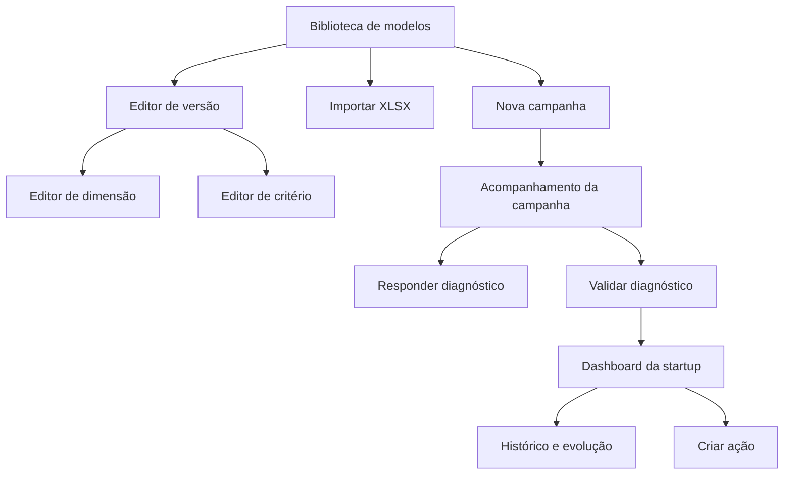

# Diagnósticos — mapa de telas

## Arquitetura de navegação

## Rotas propostas

| Tela          | Rota                                                            |
| ------------- | --------------------------------------------------------------- |
| Biblioteca    | `/diagnosticos/modelos`                                         |
| Novo/importar | `/diagnosticos/modelos/novo` e `/diagnosticos/modelos/importar` |
| Editor        | `/diagnosticos/modelos/[templateId]/versoes/[versionId]`        |
| Nova campanha | `/diagnosticos/campanhas/nova`                                  |
| Campanha      | `/diagnosticos/campanhas/[campaignId]`                          |
| Resposta      | `/diagnosticos/responder/[assessmentId]`                        |
| Validação     | `/diagnosticos/validar/[assessmentId]`                          |
| Startup       | `/diagnosticos/startups/[startupId]/avaliacoes/[assessmentId]`  |
| Histórico     | `/diagnosticos/startups/[startupId]/historico`                  |

Todas ficam sob `/o/[organizationSlug]/i/[incubatorSlug]`.

## Matriz imagem–componente

| Referência           | Objetivo                  | Componentes principais                                                                               | Dados reais                        |
| -------------------- | ------------------------- | ---------------------------------------------------------------------------------------------------- | ---------------------------------- |
| 01 Biblioteca        | localizar e gerir métodos | `PageHeader`, `LibraryTabs`, `FilterBar`, `TemplateTable`, `StatusBadge`, `CursorPagination`         | famílias/versões autorizadas       |
| 02 Editor dimensão   | montar estrutura          | `EditorTabs`, `StructureTree`, `DimensionForm`, `StructureSummary`, `ValidationChecklist`            | versão em rascunho                 |
| 03 Editor critério   | detalhar pergunta/rubrica | `Breadcrumb`, `CriterionForm`, `RubricEditor`, `StageChips`, `TriggerSelect`                         | critério e níveis                  |
| 04 Nova campanha     | configurar lote           | `CampaignStepper`, formulários por etapa, `CampaignSummary`                                          | versão, programa, turma e startups |
| 05 Campanha          | operar o ciclo            | `CampaignKpis`, `CampaignFilters`, `ParticipantTable`, `RowActions`                                  | participantes/instâncias           |
| 06 Responder         | autoavaliação             | `AssessmentProgress`, `DimensionNavigator`, `CriterionResponse`, `EvidenceUploader`, `AutosaveState` | instância do usuário               |
| 07 Dashboard startup | decisão e acompanhamento  | `AssessmentHeader`, `ScoreCards`, `RadarChart`, `DimensionBars`, `TrendChart`, `TriggerList`         | snapshots oficiais                 |
| 08 Histórico         | comparar ciclos           | `CycleComparisonTable`, `DimensionEvolutionTable`, `CompareCyclesAction`                             | série ilimitada                    |

## Diferenças obrigatórias em relação às imagens

- números, nomes e datas ilustrativos não serão copiados;
- contagens do XLSX são 9 dimensões e 36 critérios, não 86/98;
- tabelas ganham estado vazio, erro, loading, paginação por cursor e responsividade;
- ações em ícones têm rótulo acessível e confirmação quando destrutivas;
- cabeçalho e sidebar reutilizam o shell atual, sem duplicação;
- gráficos terão alternativa tabular e não dependerão apenas de cor;
- upload aceita metadado pendente e mostra falhas do Drive;
- a tela de resposta nunca apresenta controles de validação;
- a tela de validação preserva lado a lado o declarado e o oficial.

## Wireflow por perfil

### Gestor

Biblioteca → cria/importa rascunho → corrige validações → publica versão → cria campanha → acompanha participantes → atribui avaliador → encerra ciclo → analisa dashboard → cria ações.

### Startup

Convite autenticado → abre instância própria → responde por dimensão → anexa evidência → salva automaticamente → envia → acompanha status → consulta resultado liberado.

### Avaliador

Lista de instâncias atribuídas → revisa resposta/evidência → registra nota e parecer → devolve ou valida → finaliza → gera score/gatilhos auditados.

## Estados de interface

Cada rota deve cobrir:

- loading com skeleton compatível com o layout;
- vazio com próxima ação adequada à permissão;
- erro recuperável com ID de correlação;
- sem permissão sem revelar existência de outro tenant;
- offline/autosave pendente;
- conflito de edição;
- sucesso com feedback persistente e foco gerenciado.

## Responsividade

- desktop: árvore + editor + resumo em três colunas;
- tablet: árvore retrátil e resumo em drawer;
- mobile: fluxo sequencial, filtros em sheet e tabelas convertidas em cards sem ocultar ações essenciais;
- alvos de toque mínimos, contraste WCAG AA, navegação completa por teclado e `aria-live` para autosave.

## Dados ilustrativos permitidos

Somente Storybook/testes/preview podem usar exemplos fictícios, sempre marcados como `DADOS DEMONSTRATIVOS`. Produção não terá fallback silencioso para mocks.
