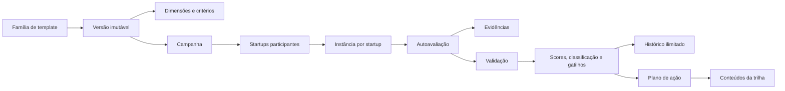

# Diagnósticos — arquitetura-alvo

## Princípios

- diagnóstico sempre pertence a uma incubadora e cada aplicação pertence a uma startup;
- CERNE é apenas uma metodologia opcional;
- versões publicadas são snapshots imutáveis;
- campanha seleciona uma versão publicada, nunca uma família mutável;
- autoavaliação e validação têm autoridades e históricos distintos;
- indicadores não alteram o score de maturidade;
- arquivos ficam no Google Drive; metadados, autorização e auditoria ficam no Supabase;
- cálculos oficiais e transições críticas são transacionais no PostgreSQL;
- RLS é obrigatória em toda tabela exposta.

## Fluxo de domínio



## Modelo de dados

### Catálogo e versão

- `diagnostic_template_families`: identidade estável do método, proprietário, origem e compartilhamento;
- `diagnostic_templates`: permanece como registro de versão para evitar reescrita destrutiva; recebe FK real para a família e metadados de versão;
- `diagnostic_dimensions`: acrescenta código e essencialidade;
- `diagnostic_dimension_stages`: associação normalizada aos estágios;
- `diagnostic_criteria`: acrescenta código, regra de N/A e notas internas;
- `diagnostic_criterion_stages`;
- `diagnostic_criterion_levels`: rubricas 0–4 normalizadas;
- `diagnostic_classification_ranges`;
- `diagnostic_trigger_rules`;
- `diagnostic_indicator_definitions`.

### Aplicação

- `diagnostic_campaigns`: versão, programa/turma opcionais, período, timezone, estado e responsável;
- `diagnostic_campaign_startups`: snapshot das startups convidadas;
- `diagnostic_assessments`: continua sendo a instância e recebe campanha, prazo, versão de concorrência e estado operacional;
- `diagnostic_respondents`: pessoas autorizadas por instância e papel colaborativo;
- `diagnostic_responses`: mantém a resposta corrente autodeclarada durante a transição;
- `diagnostic_response_validations`: parecer oficial e histórico de revisão separado;
- `diagnostic_response_evidence`: referência a `files` ou link externo, estado e auditoria;
- `diagnostic_indicator_values`;
- `diagnostic_dimension_scores`;
- `diagnostic_trigger_results`;
- `diagnostic_history_events`.

### Compatibilidade

Os registros existentes não serão apagados. `diagnostic_templates.family_id` será materializado em `diagnostic_template_families`; respostas e valores validados atuais serão migrados para as novas estruturas. A UI antiga poderá continuar lendo as colunas legadas durante uma janela curta, até a troca por queries dedicadas.

## Cálculos oficiais

Para cada critério aplicável:

```text
criterion_ratio = score / maximum_score
dimension_score = 100 × Σ(criterion_ratio × criterion_weight) / Σ(criterion_weight)
overall_score = Σ(dimension_score × dimension_weight) / Σ(dimension_weight aplicável)
```

- N/A é excluído do numerador e denominador e exige justificativa quando configurado;
- score validado prevalece como oficial; score autodeclarado permanece comparável;
- classificação usa as faixas 0–24, 25–44, 45–64, 65–84 e 85–100;
- gap por critério é `validado - autodeclarado`; gap médio é calculado apenas onde ambos existem;
- cobertura de evidência é a proporção de notas que atingem o limiar e possuem evidência válida;
- alavancagem, confirmada no XLSX, é `peso_da_dimensão × distância_até_100`;
- gatilhos são avaliados separadamente e não são compensados por score alto;
- a regra histórica de recuperação usa dois ciclos consecutivos sem evolução e execução do plano abaixo de 50%.

Funções propostas:

- `publish_diagnostic_template_version(version_id)`;
- `create_diagnostic_campaign(...)`;
- `dispatch_diagnostic_campaign(campaign_id)`;
- `save_diagnostic_response(...)` com `lock_version`;
- `submit_diagnostic_assessment(assessment_id)`;
- `validate_diagnostic_response(...)`;
- `finalize_diagnostic_assessment(assessment_id)`;
- `recompute_diagnostic_assessment(assessment_id)`.

As funções `security definer` ficam em schema não exposto, usam `search_path = ''`, objetos totalmente qualificados, checam `auth.uid()` internamente e têm `EXECUTE` revogado por padrão.

## RLS e privilégios

### Matriz resumida

| Papel                | Modelos                 | Campanhas            | Responder         | Validar                    | Indicadores financeiros       |
| -------------------- | ----------------------- | -------------------- | ----------------- | -------------------------- | ----------------------------- |
| admin Proodos        | governança explícita    | auditoria            | não por padrão    | não por padrão             | somente autorização explícita |
| gestor incubadora    | CRUD no tenant          | CRUD                 | acompanhar        | validar/atribuir           | sim                           |
| coordenador programa | ler/usar                | programas atribuídos | acompanhar        | se atribuído               | conforme permissão            |
| avaliador            | ler versão aplicada     | campanhas atribuídas | não               | sim, instâncias atribuídas | conforme necessidade          |
| startup/respondente  | versão aplicada         | própria participação | própria instância | não                        | próprios dados                |
| mentor               | nenhum acesso implícito | não                  | não               | não                        | somente concessão explícita   |

Regras:

- toda tabela carrega `organization_id` e `incubator_id` quando aplicável;
- FKs compostas impedem referências cruzadas entre tenants;
- acesso a campanha não implica acesso irrestrito a todas as startups;
- respondente precisa estar em `diagnostic_respondents` ou ser representante ativo autorizado;
- avaliador precisa de permissão e atribuição à instância/campanha;
- service role nunca participa do navegador;
- índices cobrem FKs e colunas usadas em políticas;
- views expostas usam `security_invoker = true`.

## Concorrência e autosave

- `lock_version bigint` na instância/resposta;
- update condicional por `id + lock_version`;
- incremento atômico no banco;
- conflito `409` preserva o rascunho local e oferece recarregar/comparar;
- autosave com debounce, indicador `salvando/salvo/erro/offline` e botão explícito “Salvar e sair”;
- transações permanecem curtas e não incluem chamadas ao Google Drive ou notificações.

## Evidências e falhas parciais

1. cria-se intenção/metadado pendente no Supabase;
2. o navegador/servidor envia ao Drive por upload resumível;
3. registra-se `file_version` e liga-se à resposta;
4. a evidência passa por `pending`, `available`, `rejected`, `deleted` ou `restore_pending`;
5. falhas após upload geram reconciliação; nunca se concede acesso apenas por URL.

## Consultas e desempenho

- loaders por rota, sem carregar o módulo inteiro;
- paginação por cursor em bibliotecas e campanhas;
- índices compostos por `(organization_id, incubator_id, status, created_at, id)`;
- índices parciais para campanhas/instâncias abertas;
- snapshots de score materializados por instância para dashboards reproduzíveis;
- gráficos recebem dados agregados do servidor, sem recalcular regra de negócio no cliente.
